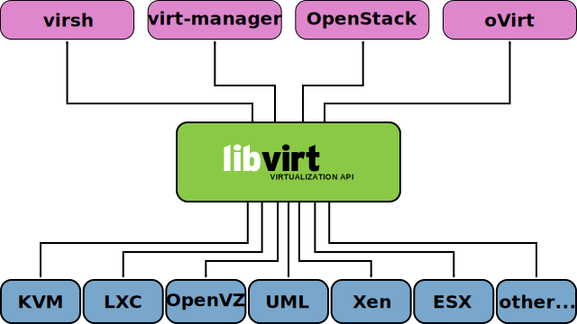

# KVM

## KVM Diagram


### KVM Hardware requirements

On the AMD64/Intel 64 architecture, you can test whether your CPU supports hardware virtualization with the following command: `egrep '(vmx|svm)' /proc/cpuinfo`

## Libvirt Support



### Adding permissions for using libvirt

- Add user to the libvirt group: `usermod --append --groups libvirt gpoppino`
  - This group is specified in option `unix_sock_group` in `/etc/libvirt/libvirtd.conf`

### Libvirtd daemon

- Check that libvirtd is running: `systemctl status libvirtd`

## KVM Tools

### Installation of the KVM hypervisor and its tools

- Select the _system role_ "KVM Virtualization Host" during installation:


Or

- Go to _YaST -> Virtualization -> Install Hypervisor and Tools_
  - Select options _KVM Server_ and _KVM Tools_


### Tools

Some of the command line tools are:

- virsh: operate on VMs.
- virt-install: install VMs.
- virt-clone: clone VMs.
- virt-convert: convert a VM from OVF or VMX to native libvirt XML.

Graphical tools are:

- virt-manager: GUI to work with VMs.
- virt-viewer: display a graphical console for a VM.

### Connecting

Set the variable _LIBVIRT_DEFAULT_URI_ to:

- `qemu:///system`: connect locally as root to the daemon supervising QEmu and KVM domains
- `qemu:///session`: connect locally as a normal user to his own set of QEmu and KVM domains

For example:

```bash
export LIBVIRT_DEFAULT_URI=qemu:///system
virsh list --all
```

Otherwise, use _-c_ or _--connect_:
  - `virsh -c qemu:///system list --all`
  - `virsh -c qemu+ssh://gpoppino@lab/system list --all`

### Working with VMs

- List domains (inactive and active): `virsh list --all`
- Obtain information about the VM: `virsh dominfo VM_NAME`
- Start a VM: `virsh start VM_NAME`
- Shutdown a VM: `virsh shutdown VM_NAME`
- Poweroff a VM: `virsh destroy VM_NAME`
- Reboot a VM: `virsh reboot VM_NAME`
- Delete a VM: `virsh undefine VM_NAME; virsh vol-delete --pool default VM_IMAGE.qcow2`

### Connecting to the console

Procedure for SLES11 (inside de VM):

1. Edit _/etc/inittab_ and uncomment the following line: `S0:12345:respawn:/sbin/agetty -L 9600 ttyS0 vt102`
2. Run `telinit q`
3. If you want to login with root, edit _/etc/securetty_ and add _ttyS0_.

In SLES12 (inside the VM):

1. Run the following commands:

```bash
  systemctl enable serial-getty@ttyS0.service
  systemctl start serial-getty@ttyS0.service
```

Finally, run `virsh console VM_NAME` or `virsh console ID`.

### Configuration

- Edit a VM's config file: `virsh edit VM_NAME`

### Virtual CPU and memory configuration

#### VCPUs

- Check Virtual CPUs of a VM: `virsh vcpuinfo VM_NAME`
- View vcpus configuration: `virsh vcpucount VM_NAME`
- Increment vcpus on a running guest VM and make it permanent (max vcpus must allow this value / --maximum flag): `virsh setvcpus 4 --config --live`

#### Memory

- Set the maximum memory allowed for a VM: `virsh setmaxmem VM_NAME 2048M --config`
- Set increment de memory for a VM: `virsh setmem VM_NAME 2048M --config --live`

### Installation of VMs

- Install a VM: `virt-install --cdrom /path/to/ISO --name "SLES12_SP3" --memory 2048 --virt-type kvm --connect qemu:///system --disk size=10`

### Working with disk images

- Add 5GB to an existing disk image: `qemu-img resize my_image.qcow2 +5G`
- Convert from HyperV to KVM: `qemu-img convert -O qcow2 source.vhdx output_image.qcow2`

### Cloning and Snapshotting

Definition:

Snapshots let you restore the state of the machine at a particular point in time. VM Guest snapshots are snapshots of the complete virtual machine including the state of CPU, RAM, devices, and the content of all writable disks.

There are different types of snapshots:

1. Internal: Snapshots that are saved into the qcow2 file of the original VM Guest.
2. External: When creating an external snapshot, the original qcow2 file is saved and made read-only, while a new qcow2 file is created to hold the changes. External snapshots are useful when performing backups of VM Guests.

Also the snapshots can be:

1. Live: Snapshots created when the original VM Guest is running.
2. Offline: Snapshot created from a VM Guest that is shut off.

How to:

- Clone a VM in a simple way (domain/VM must be paused or shutoff): `virt-clone --original ORIGINAL_VM_NAME --auto-clone`
- Clone a VM with one disk (domain/VM must be paused or shutoff): `virt-clone --connect qemu:///system --original ORIGINAL_VM_NAME --name MY_CLONE --file my_clone.qcow2`
- Take a snapshot of a VM: `virsh snapshot-create-as --domain VM_NAME --name "VM_NAME_SNAPHOST01" --description "My VM_NAME snapshot"`
- List snapshots of a VM: `virsh snapshot-list VM_NAME`
- Revert to a snapshot: `virsh snapshot-revert --domain VN_NAME --snapshotname VM_NAME_SNAPSHOT01 --running`
- Delete an snapshot: `virsh snapshot-delete --domain VM_NAME --snapshotname VM_NAME_SNAPSHOT01`

### Pools and Volumes

Definitions:

1. A _Storage Volume_ is storage device that can be assigned to a guest (physical or a file).
2. A _Storage Pool_  is a storage resource on the VM Host Server that can be used for storing volumes.

Types: file system (dir), physical device (disk), pre-formatted block device (fs - auto mounts the filesystem), iSCSI Target (iscsi), LVM Volume Group (logical), Multipath Devices (mpath), Network Exported Directory (netfs), SCSI Host Adapter (scsi), RADOS Block Device/Ceph (rbd), etc.

How to:

- List pools: `virsh pool-list`
- Obtain information about a pool: `virsh pool-info POOL`
- List volumes in a pool: `virsh vol-list POOL --details`
- See pool configuration: `virsh pool-dumpxml POOL`
- Edit an existing pool configuration: `virsh pool-edit POOL`
- Create a new pool of type _dir_: `virsh pool-create-as --name mypool --type dir --target /mnt`
- Create a new volume in a pool: `virsh vol-create-as mypool myvol 20GB --format qcow2`
- Clone a volume: `virsh vol-clone myvol myvol-clone --pool mypool`
- Attach a volume to a guest domain: `virsh attach-disk sles12sp3 /var/lib/libvirt/images/myvol.qcow2 sda2`

### Networking

- List networks: `virsh net-list`
- Edit an existing network: `virsh net-edit NETWORK_NAME`

### Sharing a host directory to access in the guest

In _virt-manager_:

1. Go to _Hardware details -> Add Hardware -> Filesystem (Passthrough)_
2. In _Source path_ add the path to the directory to share.
3. In _Target path_ add the share name.

In the Guest VM, run:

1. `mount -t 9p -o trans=virtio shareName /mnt`

Where _shareName_ is the name of the share in step 3 and _/mnt_ is the mount point you choose to mount the share.

## Reference

- [Official SUSE Documentation for Virtualization on SLES 12](https://www.suse.com/documentation/sles-12/singlehtml/book_virt/book_virt.html)
- [Virtual Machine Manager](https://virt-manager.org/)
- [Live disk backup](https://wiki.libvirt.org/page/Live-disk-backup-with-active-blockcommit)
- [Backup scripts](https://gist.github.com/cabal95/e36c06e716d3328b512b)
